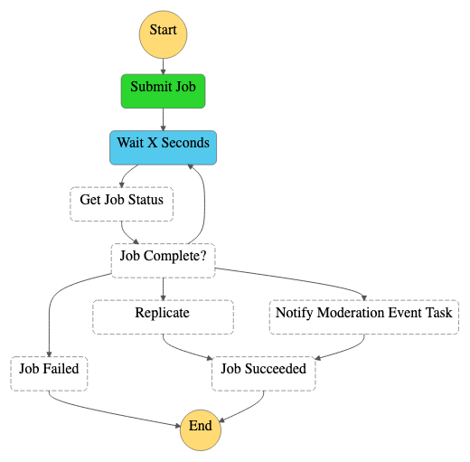
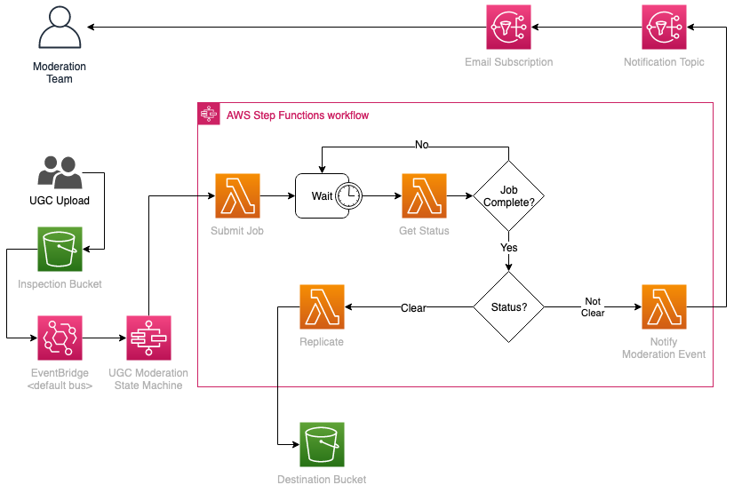

# User Generated Content Moderation Video Pipeline

## Introduction
This code sample illustrates a minimal User Generated Content Moderation Pipeline
for video files. It makes use of Rekognition Moderation capabilities to scan 
video content for inappropiate images. The rationale behind this code sample is 
to block UGC from progressing further in the analysis pipeline, so that customers 
don't perform AI/ML workloads on inappropiate content.

## Process
- Users upload media content to the inspection bucket deployed by the code sample
- An upload notification is sent on EventBridge which triggers the UGC state machine

- if the video is clear from inappropiate content, it gets replicated to
a destination bucket
- otherwise, an email is sent to the moderation team for further inspection

## Architecture


## Deployment Instructions
```bash
REPLICATION_BUCKET_NAME=<YOUR_BUCKET_NAME> # for example "my-bucket-name"
NOTIFICATION_EMAIL_ADDRESS=<YOUR_EMAIL_ADDRESS> # for example "you@yourcompany.com"

npm i
cd app && npm i && cd ..

cdk deploy \
    --parameters replicationBucketName=$REPLICATION_BUCKET_NAME \
    --parameters notificationEmailAddress=$NOTIFICATION_EMAIL_ADDRESS \
    --outputs-file assets/cdk-outputs.json
```

### Parameters
`replicationBucketName` is the bucket where the object will be replicated if it 
does not contain inappropriate content. This must be in the same region as this stack.  
`notificationEmailAddress` is valid email address where you'll receive moderation
events notifications. Expect a confirmation email to this address from AWS SNS. Make sure you confirm the SNS subscription.

## Running the Workflow
You can start the workflow by uploading a video to your S3 bucket at the `/public/upload/` path.
For example, run the following

```bash
INSPECTION_BUCKET=$(cat ./assets/cdk-outputs.json | jq .BasupUgcStackStack.InspectionBucketName | xargs)
UPLOAD_FILE_PATH=path/to/your/video

aws s3 cp $UPLOAD_FILE_PATH s3://$INSPECTION_BUCKET/public/upload/
```

You can monitor the execution of the flow in your StepFunction Console

### Acknowledgements 
This code sample has been developed by the UKIR Green Field Startup Solutions Architecture Team @AWS.